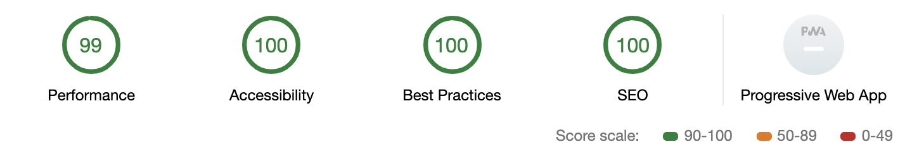

# [Eric Clemmons' Website][site]

> Static markdown blog powered by:
>
> - `ʦ` [TypeScript][ts]
> - `↓` [MDX][mdx]
> - `⚛`️ [React][react]
> - `♒︎` [TailwindCSS][tailwind]
> - `♻` [hot-module-replacement][hmr]
> - `▲` [Now][now]
>
> 

## Getting Started

After cloning normally:

1. `yarn install`
1. `yarn dev`
1. Visit <http://localhost:3000/>.

## Authoring

The authoring experience is pretty simple!

1. Manage content in `/content/:url/index.mdx`.

   _I've been using https://medium-to-markdown.now.sh/ to convert my Medium posts over._

   1. Add an `./index.tsx` file to **asynchronously prefetch data**.

1. Customize `/components` as needed, primarily through `Layout.tsx`.

1. Add assets in `/public` to serve statically.

   1. Customize `/public/index.html` as needed.

1. **All changes are [hot-reloaded][hmr]**. Refresh for changes!

## Deployment

The site is statically rendered and can be deployed via [Now][now].

1. `yarn build`
1. `yarn deploy`

[hmr]: https://github.com/sidorares/hot-module-replacement
[mdx]: https://mdxjs.com/
[now]: https://zeit.co/now
[react]: https://reactjs.org/
[site]: https://ericclemmons.com/
[tailwind]: https://tailwindcss.com/
[ts]: https://www.typescriptlang.org/
